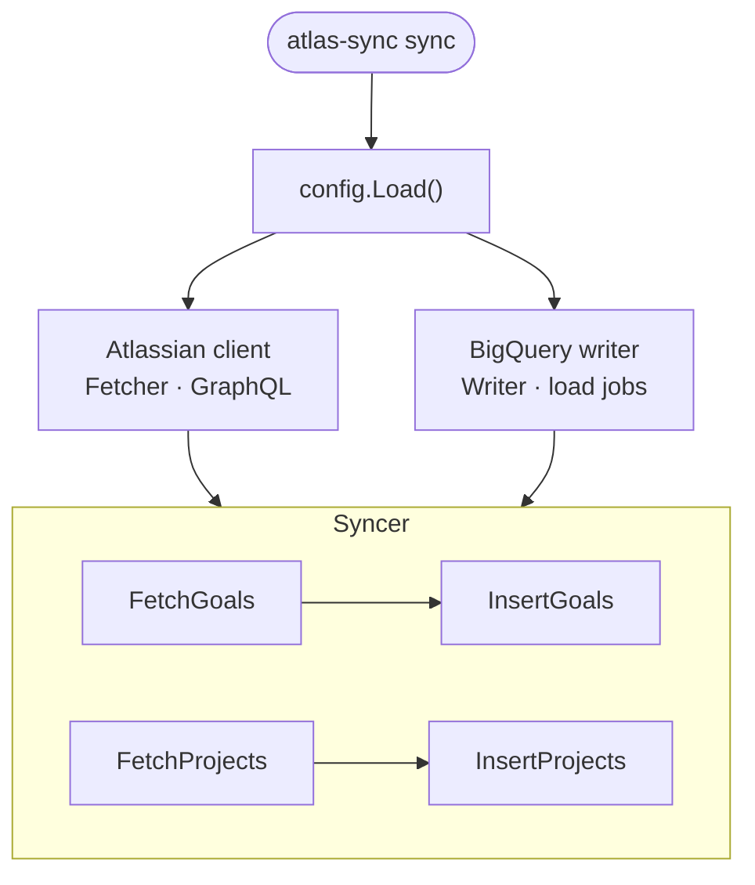
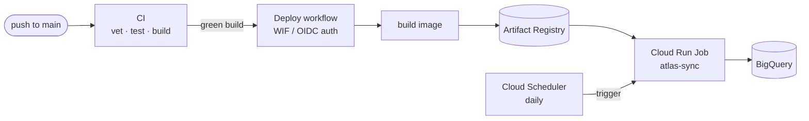

# atlas-sync

[](https://github.com/RomanUrakhov/atlas-sync/actions/workflows/ci.yml)


A Go CLI that pulls **Goals** and **Projects** from Atlassian's GraphQL API and lands them in **BigQuery** for reporting.

Built as a learning project — and then taken all the way to production: it runs daily as a Cloud Run Job, deploys itself on every push to `main`, and uses no long-lived credentials anywhere. The interesting parts aren't the sync logic; they're the testability seams in the code and the keyless, fully-Terraformed delivery pipeline behind it.

## How it works



The `Syncer` is the heart of it. It depends on a `Fetcher` interface (the Atlassian client) and a `Writer` interface (BigQuery), so either side can be swapped for a fake in tests — `bqwriter` ships an in-memory writer for exactly this. Pagination is handled inside the client with cursor-based loops (50 records per page).

## Engineering decisions

The non-obvious choices are written up as ADRs in [`docs/adr/`](docs/adr):

- **[No SA key files — attached identity via ADC](docs/adr/0001-attached-identity-adc.md).** `bigquery.NewClient` runs with zero explicit credentials; in Cloud Run the metadata server supplies auto-rotated tokens for the attached service account. No key to leak or rotate.
- **[Workload Identity Federation for CI → GCP](docs/adr/0002-workload-identity-federation-github-actions.md).** GitHub Actions authenticates to GCP via OIDC token exchange instead of a stored JSON key. No long-lived credential exists in GitHub Secrets.
- **[A shared `automations` GCP project](docs/adr/0003-shared-automations-gcp-project.md).** One billing/IAM/state boundary for this and future automation flows, so the bootstrap cost is paid once.

[`CONTEXT.md`](CONTEXT.md) defines the domain language (sync, goal, project, cloud ID) the code and docs stick to.

## Local development

You'll need a [personal Atlassian API token](https://id.atlassian.com/manage-profile/security/api-tokens) and a BigQuery dataset.

```bash
export ATLASSIAN_EMAIL=you@example.com
export ATLASSIAN_API_TOKEN=your-token
export ATLASSIAN_CLOUD_ID=your-cloud-id
export BIGQUERY_PROJECT=your-gcp-project
export BIGQUERY_DATASET=your-dataset
export BIGQUERY_TABLE=your-table
```

```bash
make run               # build + sync
make build             # build only
make test              # unit tests
make test-integration  # integration tests (needs live credentials)
```

Or run the binary directly:

```bash
./atlas-sync sync
```

## Deployment

The pipeline is keyless end to end and defined entirely in [`infra/terraform/`](infra/terraform):



CI runs on every push and PR ([`.github/workflows/ci.yml`](.github/workflows/ci.yml)). On a green build of `main`, the deploy workflow ([`.github/workflows/deploy.yml`](.github/workflows/deploy.yml)) authenticates via WIF, pushes a SHA-tagged image to Artifact Registry, and points the Cloud Run Job at it. Cloud Scheduler triggers the job daily. Secrets live in Secret Manager; the runtime acts as an attached service account (ADR-0001).

### One-time bootstrap

Terraform can't provision the GCS bucket that holds its own state, so that — plus enabling APIs — is a single manual step per project:

```bash
gcloud auth login
gcloud config set project automations-498612
./infra/bootstrap.sh          # idempotent; enables APIs, creates the tf-state bucket
```

Terraform reads Application Default Credentials, which are **separate** from `gcloud auth login` — without them `terraform init` fails with a misleading `could not find default credentials`:

```bash
gcloud auth application-default login
cd infra/terraform && terraform init
```

> [!TIP]
> If your project differs from the default, point the backend at your bucket:
> `terraform init -backend-config="bucket=<your-project-id>-tf-state"`

## Project structure

```
cmd/atlas-sync/       # CLI entry point (cobra)
internal/
  atlassian/          # GraphQL client, FetchGoals, FetchProjects
  bqwriter/           # BigQuery writer + in-memory fake for tests
  config/             # env var loading
  models/             # typed structs for Atlassian responses
  syncer/             # orchestration logic
infra/terraform/      # all GCP infrastructure as code
docs/adr/             # architecture decision records
```

## Potential improvements

- Concurrent fetching of goals and projects
- Idempotent writes — dedup against existing BigQuery rows before inserting
- Retry with exponential backoff for transient API/BQ errors
- Generalise the pipeline to additional Atlassian resource types without restructuring
